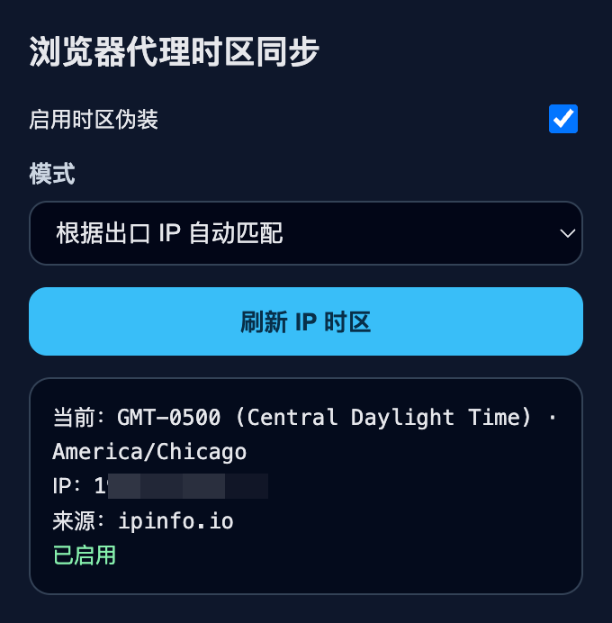
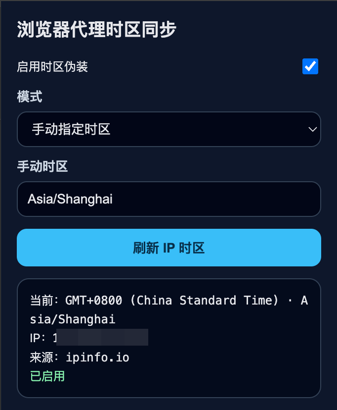

# 浏览器代理时区同步

一个 Chrome Manifest V3 浏览器插件，用于根据代理出口 IP 自动同步网页可见的浏览器时区，也支持手动指定时区。

插件主要影响网页 JavaScript 能读取到的时间和时区，例如 `Date`、`Intl.DateTimeFormat`、`getTimezoneOffset()` 等，不会修改操作系统时间或 Chrome 浏览器本身的系统时间。

## 功能

- 根据代理出口 IP 自动识别时区
- 支持手动指定 IANA 时区，例如 `America/Chicago`、`Asia/Tokyo`
- 支持启用 / 停用时区伪装
- 自动模式下隐藏手动时区输入框
- popup 中显示重点信息：
  - 当前生效时区
  - 出口 IP
  - 数据来源
  - 当前状态
- 使用浏览器风格显示时区偏移，例如：

```text
GMT-0500 (Central Daylight Time) · America/Chicago
```

## 文件结构

```text
浏览器代理时区同步/
├── manifest.json        # Chrome 插件配置
├── background.js        # 根据出口 IP 获取时区
├── content.js           # 同步配置到页面主环境
├── time-main.js         # 覆盖网页 JS 可见的 Date / Intl API
├── popup.html           # 插件弹窗页面
├── popup.js             # 插件弹窗逻辑
└── icons/               # 插件图标
```

## 安装方式

1. 打开 Chrome 扩展管理页面：

```text
chrome://extensions/
```

2. 开启右上角的 **开发者模式**。

3. 点击 **加载已解压的扩展程序**。

4. 选择目录：

```text
/Users/bwlc/Documents/浏览器脚本/浏览器代理时区同步
```

5. 加载后，工具栏会显示插件图标。

## 使用方式

### 自动模式



1. 点击插件图标。
2. 打开“启用时区伪装”。
3. 模式选择：

```text
根据出口 IP 自动匹配
```

4. 点击：

```text
刷新 IP 时区
```

插件会通过多个 IP 时区接口查询当前出口 IP，并选择时区结果。

当前使用的数据源包括：

```text
ipapi.com
ipinfo.io
worldtimeapi.org
ipapi.co
ipwho.is
```

### 手动模式



1. 模式选择：

```text
手动指定时区
```

2. 输入 IANA 时区，例如：

```text
America/Chicago
Asia/Tokyo
Europe/London
```

3. 输入框失焦或变更后会自动保存。

## 验证方式

加载插件后，打开普通网页，例如：

```text
https://example.com
```

打开 DevTools Console，执行：

```js
Intl.DateTimeFormat().resolvedOptions().timeZone
```

应返回当前插件生效的时区，例如：

```js
"America/Chicago"
```

继续执行：

```js
new Date().toString()
```

应看到类似：

```text
Sun May 17 2026 10:00:00 GMT-0500 (Central Daylight Time)
```

再执行：

```js
new Date().getTimezoneOffset()
```

例如芝加哥夏令时期间应返回：

```js
300
```

## 关于 GMT 和 UTC

插件在显示时区偏移时统一使用浏览器常见格式：

```text
GMT-0500 (Central Daylight Time)
```

这和 `UTC-5` 表达的是同一个偏移，但更接近 Chrome 原生 `Date.prototype.toString()` 的显示风格。

## 关于夏令时

插件使用 IANA 时区规则，会根据日期自动处理夏令时。

例如 `America/Chicago`：

- 夏令时：`GMT-0500 (Central Daylight Time)`
- 标准时间：`GMT-0600 (Central Standard Time)`

## 已覆盖的网页 API

插件会在页面主环境中覆盖或增强以下 API：

```js
Date
Date.prototype.getTimezoneOffset
Date.prototype.getFullYear
Date.prototype.getMonth
Date.prototype.getDate
Date.prototype.getDay
Date.prototype.getHours
Date.prototype.getMinutes
Date.prototype.getSeconds
Date.prototype.toString
Date.prototype.toTimeString
Date.prototype.toDateString
Date.prototype.toLocaleString
Date.prototype.toLocaleDateString
Date.prototype.toLocaleTimeString
Intl.DateTimeFormat
Intl.DateTimeFormat.prototype.resolvedOptions
```

插件不会修改绝对时间戳，因此以下值仍表示真实时间点：

```js
Date.now()
new Date().getTime()
new Date().valueOf()
new Date().toISOString()
```

## 加强机制

插件会把上一次生效的时区缓存到页面的：

```js
sessionStorage
localStorage
```

这样同一网站下次加载时，可以更早应用上一次的时区配置，减少检测网站在页面极早期读取真实时区的概率。

如果第一次检测网站显示不一致，可以刷新页面再测试一次。

## 常见问题

### 1. 为什么 popup 显示的时区和检测网站不一致？

检测网站可能不只看 JS 时区，还可能看：

- 服务端根据 IP 查询的位置
- WebRTC
- Accept-Language
- 系统语言
- Canvas / WebGL 指纹
- 页面极早期读取到的真实时区

本插件主要修改网页 JavaScript 可见的时间和时区，不能修改服务器端通过 IP 得到的位置。

### 2. 为什么 `America/Chicago` 有时是 GMT-0500，有时是 GMT-0600？

这是夏令时导致的正常现象。

- 夏令时期间：`GMT-0500`
- 标准时间期间：`GMT-0600`

### 3. 为什么自动获取时区失败？

可能是 IP 查询接口被网络、代理或服务限制拒绝。

可以尝试：

- 点击“刷新 IP 时区”
- 切换代理后重新刷新
- 改用手动模式

### 4. 修改代码后为什么没生效？

需要在：

```text
chrome://extensions/
```

点击该插件的重新加载按钮，然后刷新目标网页。

## 限制

插件不能修改：

- 操作系统时间
- Chrome UI 显示时间
- 服务端看到的请求时间
- TLS / HTTP 层时间
- 服务器根据 IP 查询到的位置
- `chrome://` 页面
- Chrome Web Store 页面

此外，极少数页面可能在插件配置同步前读取真实时区。插件已经通过 `document_start` 注入和本地缓存预加载降低这个概率，但无法保证所有页面 100% 覆盖。

## 调试建议

在目标网页控制台执行：

```js
{
  timezone: Intl.DateTimeFormat().resolvedOptions().timeZone,
  offset: new Date().getTimezoneOffset(),
  text: new Date().toString(),
}
```

如果这些值和插件 popup 显示一致，说明 JS 层伪装已生效。

如果检测网站仍显示其他地区，通常说明该网站主要基于 IP 或其他指纹判断。
